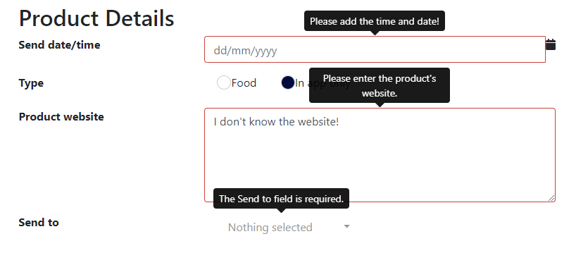

# Custom Validation Message

## Problem

Depending on the context taken from the entity definition (e.g., type, mandatory/non-mandatory, etc.),
M# will generate a validation message or set of messages for a given property.
Sometimes the business logic of your application requires a certain context to be given as part of a
validation message that extends away from these standard messages.

## Implementation

Your custom validation should be set at either the entity or module level, depending on your requirements.
M# allows you to customise messages using the `RequiredValidationMessage(string)` and `FormatValidationMessage(string)`
methods.


#### Example

Let's say we have a product class with some interesting properties and specific validation requirements. Firstly, the client
wanted a sense of urgency in the requirement validation for the `ProductionDate_Time` property as opposed to
the more reserved default _"The Production date/time field is required."_
Also, the product website must be of the form of a URL when input.

```csharp
using MSharp;

namespace Domain
{
    public class Product : EntityType
    {
        public Product()
        {
            DateTime("Production date/time").Mandatory()
                .RequiredValidationMessage("Please add the time and date!");
            Bool("IsFood").TrueText("Food").FalseText("Not food").Mandatory();
            String("Product website").Max(200)
                .Mandatory()
                .Accepts(TextPattern.InternetURL)
                .FormatValidationMessage("Please enter the product's website.");
            Associate<Member>("Member");
            Associate<Customer>("Customer");
        }
    }
}
```

These custom validation messages will be rendered throughout the application where the product entity is utilised.

When custom validation messages are only required for specific modules,
implementation is coded at the module level:


```csharp
using Domain;
using MSharp;

namespace Modules
{
    class SpecialProductForm : FormModule<Product>
    {
        public NotificationForm()
        {
            HeaderText("Product Details");

            Field(x => x.ProductionDate_time)
                .WatermarkText("dd/mm/yyyy")
                .Control(ControlType.DateAndTimePicker);
            Field(x => x.IsFood).Label("Type")
                .Control(ControlType.HorizontalRadioButtons)
                .FalseText("Not food")
                .LabelCssClass("normal");
            Field(x => x.ProductWebsite).NumberOfLines(5);

            CustomField()
                .Label("Send to")
                .AsCollapsibleCheckBoxList()
                .PropertyName("Types")
                .PropertyType("List<string>")
                .DataSource("await info.Item.GetAllOrganisationTypes()")
                .CustomDataLoad("info.Types = await info.Item.GetExistingOrganisationTypes();")
                .Mandatory()
                .RequiredValidationMessage("The Send to field is required.");

            // more UI features
        }
    }
}
```

These modifications are visible in the view-model:

```csharp

public partial class NotificationForm : IViewModel
    {
        // some class members
        // ...

        [DataType(DataType.DateTime), DisplayName("Production date/time")]
        [Required(ErrorMessage="Please add the time and date!")]
        public DateTime? ProductionDate_time { get; set; }
        
        [Required]
        public bool IsFood { get; set; }
        
        [Required, DisplayName("Product website")]
        [StringLength(200, ErrorMessage = "Please enter the product's website.")]
        [RegularExpression("^(ht|f)tp(s?)\\:\\/\\/[0-9a-zA-Z]([-.\\w]*[0-9a-zA-Z])*(:(0-9)*)*(\\/?)([a-zA-Z0-9\\u00a1-\\uffff\\-\\.\\?\\,\\'\\/\\\\\\\\(\\)\\;+&%\\$#=_]*)?$", ErrorMessage = "Please enter an internet URL for your message.")]
        public string ProductWebsite { get; set; }
        
        [Required(ErrorMessage="The Send to field is required.")]
        public List<string> Types { get; set; } = new List<string>();

        // some more class members
        // ...
    }

```

With these entity- and module-level customisations, our `SpecialProductForm` is now customised suitably on the UI.



Module-level custom validation messages are especially useful for custom fields, as M# cannot know the context
for requirement/format validation and so will give a very basic, uncontextualised prompt message:

